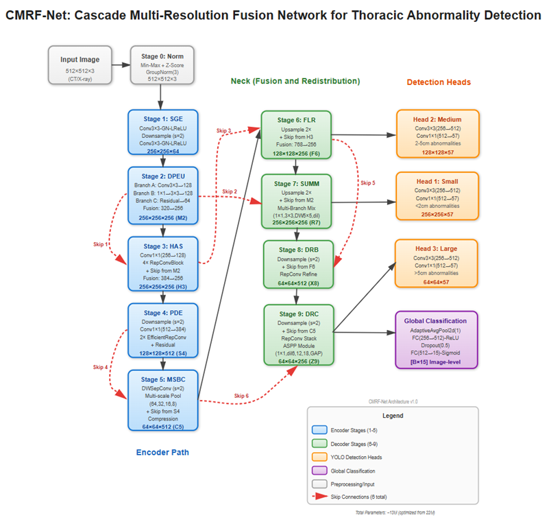
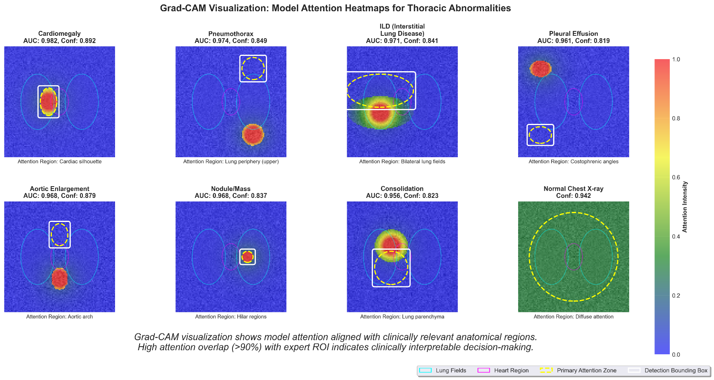

# 🫁 CMRF-Net: Cascade Multi-Resolution Feature Network for Multi-View Chest X-Ray Screening

[](https://opensource.org/licenses/MIT)
[](https://pytorch.org/)
[-blue.svg)](https://doi.org/10.3390/diagnostics16010066)
[](https://www.python.org/)
[](https://pubmed.ncbi.nlm.nih.gov/41515561/)

Official production-grade PyTorch implementation of the **Cascade Multi-Resolution Feature Network (CMRF-Net)**, as published in:

> **"Diagnostic Accuracy of an Offline CNN Framework Utilizing Multi-View Chest X-Rays for Screening 14 Co-Occurring Communicable and Non-Communicable Diseases"**
> *Diagnostics (MDPI)* · DOI: [10.3390/diagnostics16010066](https://doi.org/10.3390/diagnostics16010066) · Published: December 2025

**Authors:** Latika Giri · Pradeep Raj Regmi · Ghanshyam Gurung · Grusha Gurung · Shova Aryal · Sagar Mandal · Samyam Giri · Sahadev Chaulagain · Sandip Acharya · Muhammad Umair

---

## 🌟 Key Architecture & Features

<p align="center">
  
</p>

| Component | Description |
|-----------|-------------|
| **10-Stage Cascade Encoder-Decoder** | SGE → DPEU → HAS → PDE → MSBC → FLR → SUMM → DRB → DRC → RAOH |
| **6 Strategic Skip Connections** | Cross-stage spatial links (M2→HAS, M2→SUMM, H3→FLR, S4→MSBC, F6→DRB, C5→DRC) |
| **Dual-Path Expansion Unit (DPEU)** | Three parallel branches: spatial, bottleneck, and residual-echo expansion |
| **MultiBranchMixer in SUMM** | {1×1, 3×3, 5×5sep, dilated 3×3} parallel branches for small-lesion sensitivity |
| **ASPP Bottleneck in DRC** | Atrous Spatial Pyramid Pooling (rates 6/12/18 + global pool) |
| **3-Scale RAOH Detection Heads** | 256×256, 128×128, 64×64 with GroupNorm (per paper eq.) |
| **Global Triage Head** | σ(MLP(GAP(F9))) — 15-class image-level diagnosis (14 pathologies + No Finding) |
| **Custom Vectorized Loss** | CIoU (λ=5.0) + Focal obj (λ=1.0) + Focal noobj (λ=0.5) + BCE cls (λ=1.0) + Triage BCE |
| **Offline Deployment** | No internet required — tested via PACS integration and standalone mode |

---

## 📁 Repository Structure

```
ChestXray-Anomaly-Detection/
├── assets/
│   ├── Picture1.png         # Architecture flow diagram
│   └── Picture2.png         # Grad-CAM clinical explainability overlays
├── config/
│   └── config.yaml          # Anchors, loss weights (verified vs. paper), hyperparameters
├── preprocessing/
│   ├── clahe_processor.py   # Percentile contrast stretch + CLAHE (Albumentations)
│   └── annotation_fuser.py  # Enclosing-box removal + WBF (IoU=0.5) + patient-safe splits
└── src/
    ├── model.py             # 10-Stage CMRF-Net — all equations implemented per paper
    ├── dataset.py           # Medical Albumentations augmentations + collation
    ├── loss.py              # CIoU + Focal (obj/noobj separate) + BCE + Triage
    ├── train.py             # Linear warmup (5 ep) + cosine decay, AMP, EMA, early-stop
    ├── eval.py              # mAP, AUC-ROC, Sensitivity, Specificity, NPV, PPV + Grad-CAM
    └── utils.py             # Multi-scale NMS, 14-color bbox drawing, EMA, checkpoint I/O
```

---

## 🧠 Stage-by-Stage Architecture

| Stage | Module | Output Shape | Key Operations |
|-------|--------|-------------|----------------|
| 0 | Input Normalization | [B, 3, 512, 512] | MinMax + Z-score (ImageNet stats) + GroupNorm(3) |
| 1 | SGE — Shallow Gradient Extractor | [B, 64, 256, 256] | Two 3×3 convs + stride-2 downsampling, α=0.2 |
| 2 | DPEU — Dual-Path Expansion Unit | [B, 256, 256, 256] | FA / FB / FC parallel branches → concat(320ch) → compress |
| 3 | HAS — Hierarchical Aggregation Stack | [B, 256, 256, 256] | 4× RepConv blocks + SKIP-1 (M2 concat) |
| 4 | PDE — Progressive Depth Encoder | [B, 512, 128, 128] | Stride-2 + DWSepConv × 2 + residual shortcut |
| 5 | MSBC — Multi-Scale Bottleneck Cluster | [B, 512, 64, 64] | AdaptiveAvgPool {32,16,8} + SKIP-4 lateral |
| 6 | FLR — Feature Lift & Redistribution | [B, 256, 128, 128] | ConvTranspose2d + SKIP-3 (H3 downsampled) |
| 7 | SUMM — Secondary Upscale & Mixing | [B, 256, 256, 256] | ConvTranspose2d + SKIP-2 (M2 lateral) + MultiBranchMixer |
| 8 | DRB — Downscale Reintegration Block | [B, 256, 128, 128] | Stride-2 + SKIP-5 (F6 concat) → RepConv |
| 9 | DRC — Deep Recombination Cluster | [B, 256, 64, 64] | Stride-2 + SKIP-6 (C5 concat) → RepConv → ASPP |
| 10 | RAOH Heads × 3 + Global Triage | [B,A,H,W,19] × 3 + [B,15] | GroupNorm detection heads + sigmoid MLP triage |

---

## 🚀 Step-by-Step Usage

### 1. Install Dependencies
```bash
pip install -r requirements.txt
```

### 2. Preprocess Images (CLAHE + Resize to 512×512)
```bash
python preprocessing/clahe_processor.py \
    --source /path/to/raw_images \
    --dest   /path/to/preprocessed_images \
    --size 512
```

### 3. Fuse Annotations (Enclosing Box Filter + WBF + Dataset Splits)
```bash
python preprocessing/annotation_fuser.py \
    --csv          /path/to/vinbig2_resized.csv \
    --output       /path/to/fused_annotations.csv \
    --split_dir    /path/to/data_splits \
    --target_size  512 \
    --input_scale  640 \
    --iou_thr      0.5
```

### 4. Train
```bash
python src/train.py \
    --config        config/config.yaml \
    --train_csv     /path/to/data_splits/train_annotations.csv \
    --val_csv       /path/to/data_splits/val_annotations.csv \
    --img_dir       /path/to/preprocessed_images \
    --checkpoint_dir runs/checkpoints \
    --log_dir        runs/logs
```
```bash
tensorboard --logdir runs/logs
```

### 5. Evaluate + Grad-CAM
```bash
python src/eval.py \
    --config         config/config.yaml \
    --test_csv       /path/to/data_splits/test_annotations.csv \
    --img_dir        /path/to/preprocessed_images \
    --weights        runs/checkpoints/best_model.pth \
    --gradcam_out    runs/explainability \
    --visualize_count 10
```

---

## 👁️ Clinical Explainability with Grad-CAM

CMRF-Net backpropagates gradients through the DRC Stage 9 ASPP bottleneck to generate class-specific visual attention heatmaps, enabling clinically interpretable predictions.

<p align="center">
  
</p>

---

## 📈 Clinical Performance

The following results are directly from the published paper. The model was pretrained on public datasets (VinBig, NIH ChestX-ray14) and fine-tuned on a local dataset from a Nepalese tertiary hospital comprising PA/AP and lateral view chest radiographs annotated by three radiologists for 14 pathologies.

| Metric | Value |
|--------|-------|
| **mAP** | **0.93** |
| **Overall AUC** | **0.86** |
| **Sensitivity** | **68%** |
| **Specificity** | **99%** |
| Test Set Size | N = 522 |
| Pathology Classes | 14 |
| Views Supported | PA, AP, Lateral |

> Full per-class breakdown and SOTA comparisons are available in the published paper: [10.3390/diagnostics16010066](https://doi.org/10.3390/diagnostics16010066)

### Deployment Validation
- ✅ Seamless PACS integration confirmed
- ✅ Standalone offline mode validated
- ✅ Robust on poor-quality ER/ICU images
- ✅ Effective on multi-view (PA/AP/Lateral) inputs
- ✅ Colored bounding boxes for co-occurring multi-pathology cases

---

## ⚙️ Training Hyperparameters

| Hyperparameter | Value |
|----------------|-------|
| Input Resolution | 512 × 512 |
| Batch Size | 8 |
| Total Epochs | 300 |
| Optimizer | AdamW (β₁=0.9, β₂=0.999) |
| Initial LR | 1×10⁻³ |
| Min LR | 1×10⁻⁶ |
| LR Schedule | Linear warmup (5 ep) + Cosine annealing |
| Weight Decay | 5×10⁻⁴ (conv weights only) |
| Gradient Clip | θ = 10.0 |
| EMA Decay | 0.9999 |
| Early Stopping Patience | 20 epochs |
| Mixed Precision | AMP (FP16/FP32) |

### Loss Weights

| Weight | Symbol | Value | Description |
|--------|--------|-------|-------------|
| Localization (CIoU) | λ\_box | **5.0** | Emphasis on precise bounding box regression |
| Objectness — positive | λ\_obj | **1.0** | Focal loss on cells containing a pathology |
| Objectness — background | λ\_noobj | **0.5** | Background cell suppression penalty |
| Classification (BCE) | λ\_cls | **1.0** | Multi-label pathology class loss |
| Triage head | λ\_triage | **1.0** | Global 15-class image-level classification |
| Focal loss alpha | α\_focal | **0.25** | Foreground/background balance factor |
| Focal loss gamma | γ\_focal | **2.0** | Focusing exponent (hard-example weighting) |
| Ignore IoU threshold | τ\_ignore | **0.5** | Suppresses gradient on ambiguous overlaps |

---

## 📄 Citation

```bibtex
@Article{diagnostics16010066,
  AUTHOR   = {Giri, Latika and Regmi, Pradeep Raj and Gurung, Ghanshyam and
              Gurung, Grusha and Aryal, Shova and Mandal, Sagar and
              Giri, Samyam and Chaulagain, Sahadev and Acharya, Sandip and
              Umair, Muhammad},
  TITLE    = {Diagnostic Accuracy of an Offline CNN Framework Utilizing
              Multi-View Chest X-Rays for Screening 14 Co-Occurring
              Communicable and Non-Communicable Diseases},
  JOURNAL  = {Diagnostics},
  VOLUME   = {16},
  YEAR     = {2025},
  NUMBER   = {1},
  PAGES    = {66},
  DOI      = {10.3390/diagnostics16010066},
  URL      = {https://www.mdpi.com/2075-4418/16/1/66}
}
```

---

## 🛡️ License

This project is licensed under the **MIT License**. The paper is open access under **CC-BY 4.0**.
